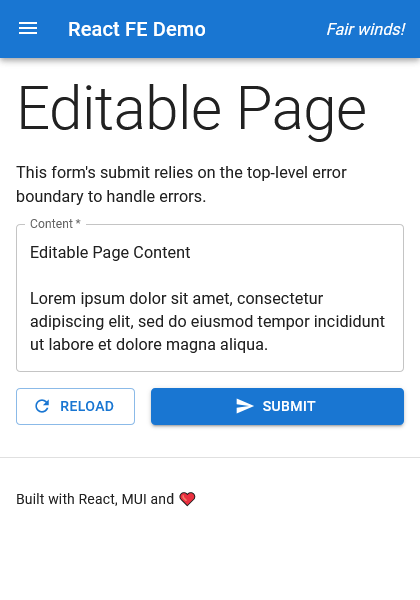
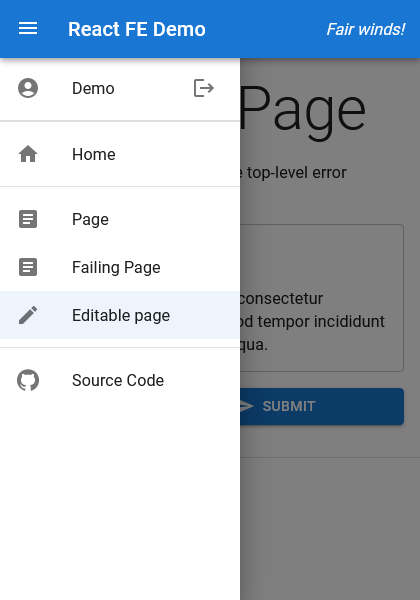
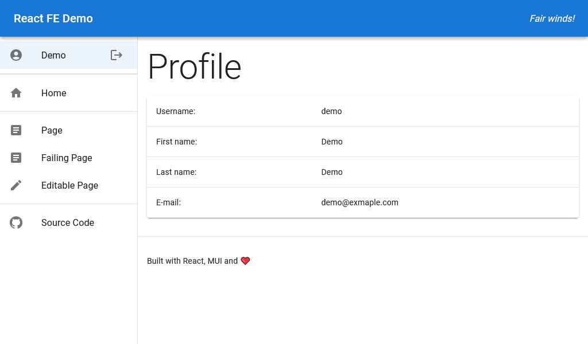

# hello-react / 03-react-keycloak

Authentication with React, prototype of the new YCC stack (but no DB). [This guide](https://medium.com/devops-dudes/secure-front-end-react-js-and-back-end-node-js-express-rest-api-with-keycloak-daf159f0a94e) and [this one](https://www.section.io/engineering-education/keycloak-react-app) were a big help to start, but Googling, reading documentation, inspecting third-party source code and trying out many things were also essential. And of course it was great fun to finally be back to web!

Components:

- `frontend-react`: as the name suggests a React frontend, port 10300 (TypeScript, MUI, Axios, gts) - start with `npm run start`
- `keycloak`: Keycloak service, port 10301 (Docker) - start with `docker-compose -p react-keycloak up`
- `backend-fastapi`: FastAPI backend, port 13002 (Python) - start with `poetry run start`

## Screenshots

Phone:



Phone menu:



Tablet:



## Keycloak Info

You can log in with `demo` / `demo` or `lajos` / `lajos`.

To manage the Keycloak instance log in with `admin` / `admin`.

### Exporting Keycloak Realms

1. Stop the Keycloak container
2. Commit the stopped Keycloak container:

   ```sh
   # Find Keycloak container ID
   docker ps -a

   # Commit the stopped container
   docker commit [KEYCLOAK CONTAINER ID] keycloak-snapshot
   ```

3. Export configuration:

   ```sh
   # Start the snapshot with a custom entrypoint
   docker run -it --entrypoint=sh keycloak-snapshot

   # This exports all realms
   mkdir /tmp/export
   /opt/keycloak/bin/kc.sh export --dir /tmp/export --users realm_file
   ```

4. Copy contents from the snapshot container:

   ```sh
   # Find snapshot container ID
   docker ps -a

   # Copy exported files from the snapshot container
   docker cp [SNAPSHOT CONTAINER ID]:/tmp/export .
   ```

5. Optionally drop `"type": "js"` policies (and policies depending on them) from the file to avoid exception during import.

For more details see the [Keycloak documentation](https://www.keycloak.org/server/importExport).
